# diStreaming 🎬

Platform streaming film modern dan responsif yang dibangun dengan teknologi web terbaru. Aplikasi ini memberikan pengalaman pengguna yang mulus untuk menjelajahi koleksi film, mencari konten favorit, dan mengelola data film melalui dasbor admin yang komprehensif.

---

## 🔗 Link Demo

| Aplikasi               | URL                                                                                              |
| ---------------------- | ------------------------------------------------------------------------------------------------ |
| **Frontend (Website)** | [https://distreaming-agus.vercel.app/](https://distreaming-agus.vercel.app/)                     |
| **Backend (API)**      | [https://api-distreaming-agus.vercel.app/api/v1](https://api-distreaming-agus.vercel.app/api/v1) |

---

## 🔑 Akun Demo

Gunakan akun berikut untuk login dan menguji fitur admin:

| Email                  | Password     |
| ---------------------- | ------------ |
| `demo@distreaming.com` | `demo123456` |

> [!TIP]
> Anda juga bisa mendaftar akun baru melalui halaman **Register** untuk mencoba fitur autentikasi.

---

## ✨ Fitur & Dokumentasi API

### 1. 👤 Autentikasi (Authentication)

Sistem login dan registrasi yang aman untuk mengakses fitur admin.

#### 📝 Register (Daftar Akun Baru)

**Endpoint:** `POST /api/v1/register`

**Request Body:**
| Field | Type | Required | Description |
|-------|------|----------|-------------|
| `name` | string | ✅ | Nama lengkap pengguna |
| `email` | string | ✅ | Email (harus unik) |
| `password` | string | ✅ | Password (min. 8 karakter) |
| `password_confirmation` | string | ✅ | Konfirmasi password |

**Contoh Input:**

```json
{
  "name": "John Doe",
  "email": "john@example.com",
  "password": "password123",
  "password_confirmation": "password123"
}
```

## Halaman Register

## 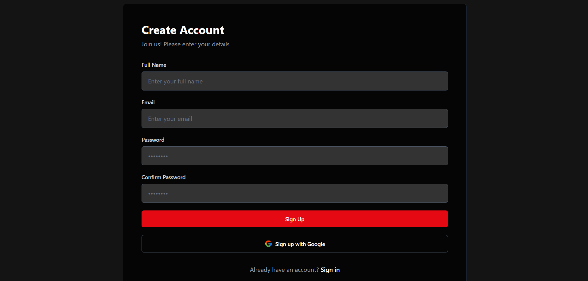

#### 🔐 Login

**Endpoint:** `POST /api/v1/login`

**Request Body:**
| Field | Type | Required | Description |
|-------|------|----------|-------------|
| `email` | string | ✅ | Email terdaftar |
| `password` | string | ✅ | Password akun |

**Contoh Input:**

```json
{
  "email": "demo@distreaming.com",
  "password": "demo123456"
}
```

**Response:** Token autentikasi yang digunakan untuk akses fitur admin.

<!-- PLACEHOLDER: Screenshot halaman login -->

## Halaman Login

## 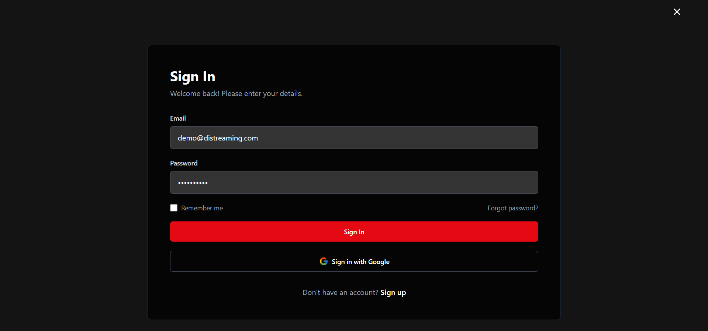

### 2. 🎬 Manajemen Film (Movies)

#### 📋 Daftar Film dengan Search, Filter & Pagination

**Endpoint:** `GET /api/v1/movies`

📁 **Implementasi Kode:** [useMovies.js](https://github.com/agusdputraa/distreaming/blob/main/src/hooks/useMovies.js) | [useFilters.js](https://github.com/agusdputraa/distreaming/blob/main/src/hooks/useFilters.js)

**Contoh URL Lengkap (dengan semua parameter):**

```
https://api-distreaming-agus.vercel.app/api/v1/movies?search=spider&genre=1&is_series=false&sort_by=title&sort_order=asc&page=1&limit=5
```

**Query Parameters:**
| Parameter | Type | Default | Description | Contoh |
|-----------|------|---------|-------------|--------|
| `search` | string | - | Cari berdasarkan judul film | `spider` → Menampilkan film dengan judul mengandung "spider" |
| `genre` | integer | - | Filter berdasarkan ID genre | `1` → Hanya genre Action |
| `is_series` | boolean | - | Filter film atau series | `true` → Hanya series, `false` → Hanya film |
| `sort_by` | string | `id` | Kolom untuk sorting | `title`, `year`, `rating` |
| `sort_order` | string | `desc` | Urutan sorting | `asc` (A-Z), `desc` (Z-A) |
| `page` | integer | `1` | Halaman pagination | `2` → Halaman kedua |
| `limit` | integer | `10` | Jumlah data per halaman | `5` → Tampilkan 5 film per halaman |

> [!NOTE]
> **Contoh Penggunaan:**
>
> - Cari film "Spider": `?search=spider`
> - Film Action saja: `?genre=1`
> - Tampilkan 5 film per halaman: `?limit=5`
> - Urutkan berdasarkan rating tertinggi: `?sort_by=rating&sort_order=desc`

## Daftar Film

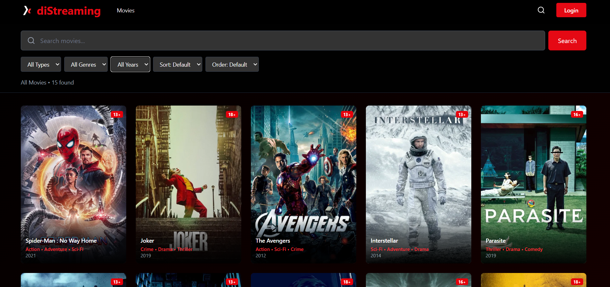

---

#### 📖 Detail Film

**Endpoint:** `GET /api/v1/movies/{id}`

**Contoh:** `GET /api/v1/movies/1`

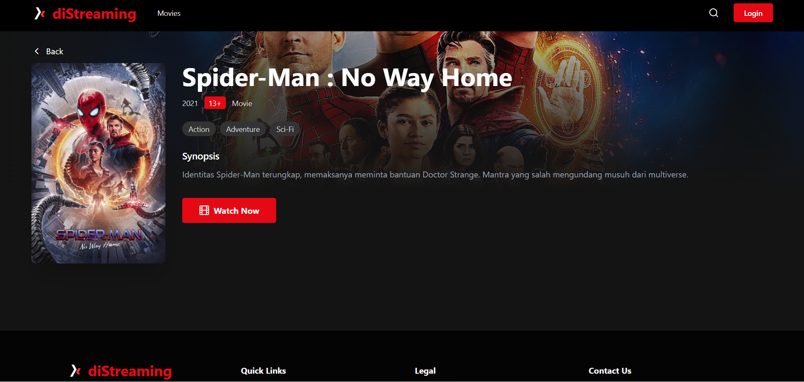

---

#### ➕ Tambah Film Baru (Admin Only)

**Endpoint:** `POST /api/v1/movies`

**Headers:** `Authorization: Bearer {token}`

**Request Body:**
| Field | Type | Required | Description |
|-------|------|----------|-------------|
| `title` | string | ✅ | Judul film |
| `year` | integer | ✅ | Tahun rilis |
| `synopsis` | string | ✅ | Sinopsis/deskripsi film |
| `rating` | string | ✅ | Rating usia (SU, 13+, 17+, 18+) |
| `thumbnail` | string | ✅ | URL gambar poster |
| `backdrop_image` | string | ❌ | URL gambar backdrop |
| `is_series` | boolean | ✅ | Apakah ini series? |
| `episodes` | integer | ❌ | Jumlah episode (jika series) |
| `genres` | array | ✅ | Array ID genre |

**Contoh Input:**

```json
{
  "title": "The Amazing Spider-Man",
  "year": 2012,
  "synopsis": "Peter Parker menemukan rahasia misterius tentang orang tuanya...",
  "rating": "13+",
  "thumbnail": "https://image.tmdb.org/t/p/w500/poster.jpg",
  "backdrop_image": "https://image.tmdb.org/t/p/original/backdrop.jpg",
  "is_series": false,
  "genres": [1, 3]
}
```

## Manajemen Film

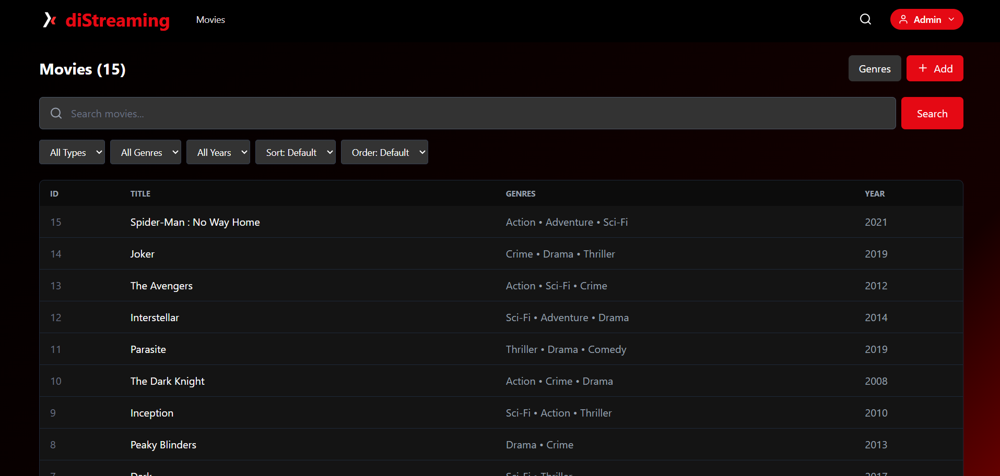

## Tambah Film

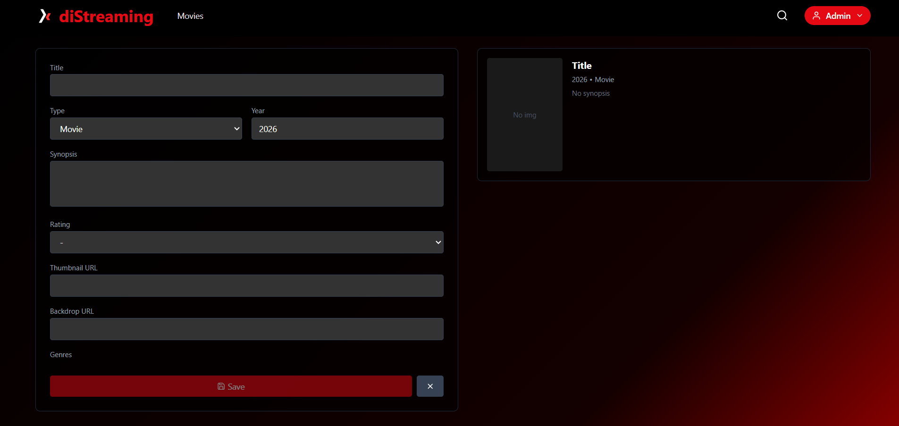

---

#### ✏️ Edit Film (Admin Only)

**Endpoint:** `PUT /api/v1/movies/{id}`

**Headers:** `Authorization: Bearer {token}`

**Request Body:** Sama seperti tambah film.

## Edit Film

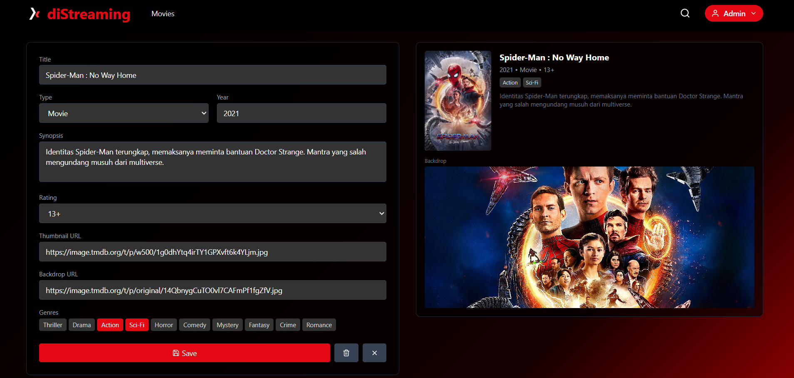

---

#### 🗑️ Hapus Film (Admin Only)

**Endpoint:** `DELETE /api/v1/movies/{id}`

**Headers:** `Authorization: Bearer {token}`

---

### 3. 🏷️ Manajemen Genre (Genres)

📁 **Implementasi Kode:** [useGenres.js](https://github.com/agusdputraa/distreaming/blob/main/src/hooks/useGenres.js)

#### 📋 Daftar Genre

**Endpoint:** `GET /api/v1/genres`

**Response:**

```json
{
  "status": "success",
  "data": [
    { "id": 1, "name": "Action" },
    { "id": 2, "name": "Comedy" },
    { "id": 3, "name": "Drama" }
  ]
}
```

## Daftar Genre

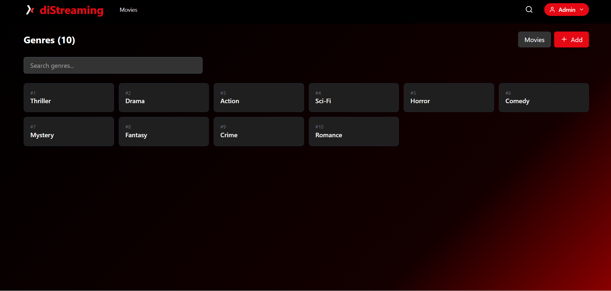

---

#### ➕ Tambah Genre (Admin Only)

**Endpoint:** `POST /api/v1/genres`

**Headers:** `Authorization: Bearer {token}`

**Request Body:**
| Field | Type | Required | Description |
|-------|------|----------|-------------|
| `name` | string | ✅ | Nama genre |

**Contoh Input:**

```json
{
  "name": "Sci-Fi"
}
```

## Tambah Genre

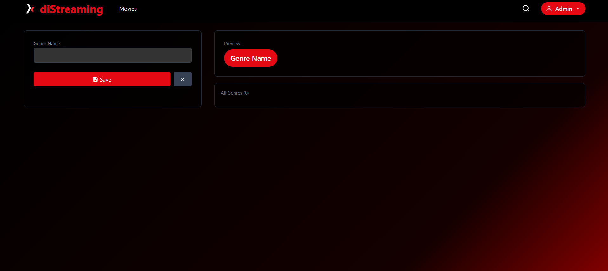

---

#### ✏️ Edit Genre (Admin Only)

**Endpoint:** `PUT /api/v1/genres/{id}`

**Headers:** `Authorization: Bearer {token}`

## Edit Genre

## 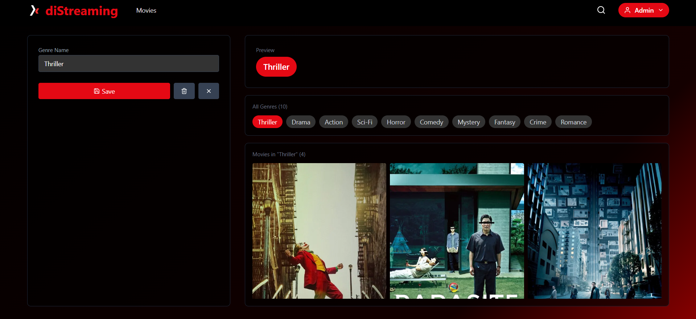

#### 🗑️ Hapus Genre (Admin Only)

**Endpoint:** `DELETE /api/v1/genres/{id}`

**Headers:** `Authorization: Bearer {token}`

---

### 4. 👥 Manajemen User (Users)

📁 **Implementasi Kode:** [useUsers.js](https://github.com/agusdputraa/distreaming/blob/main/src/hooks/useUsers.js)

Fitur admin untuk mengelola data pengguna aplikasi.

#### 📋 Daftar User (Admin Only)

**Endpoint:** `GET /api/v1/users`

**Headers:** `Authorization: Bearer {token}`

## Daftar User

## 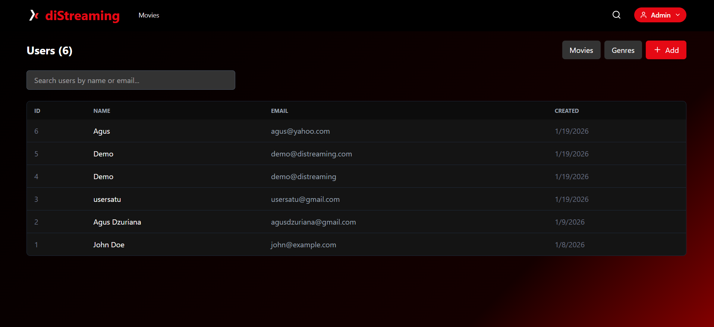

---

#### ➕ Tambah User (Admin Only)

**Endpoint:** `POST /api/v1/users`

**Headers:** `Authorization: Bearer {token}`

**Request Body:**
| Field | Type | Required | Description |
|-------|------|----------|-------------|
| `name` | string | ✅ | Nama lengkap user |
| `email` | string | ✅ | Email (harus unik) |
| `password` | string | ✅ | Password (min. 8 karakter) |
| `password_confirmation` | string | ✅ | Konfirmasi password |

**Contoh Input:**

```json
{
  "name": "New User",
  "email": "newuser@example.com",
  "password": "password123",
  "password_confirmation": "password123"
}
```

## Tambah User

## 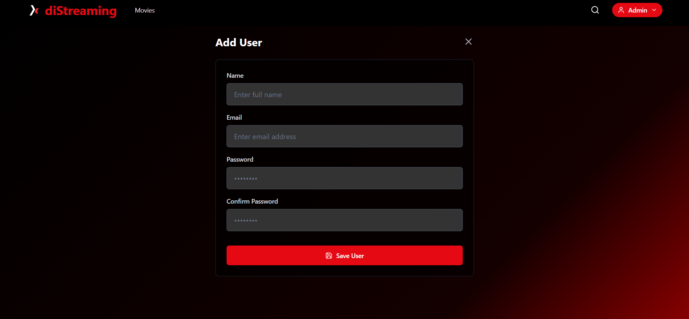

#### ✏️ Edit User (Admin Only)

**Endpoint:** `PUT /api/v1/users/{id}`

**Headers:** `Authorization: Bearer {token}`

**Request Body:** Sama seperti tambah user. Password optional (kosongkan jika tidak ingin diubah).

## Edit User

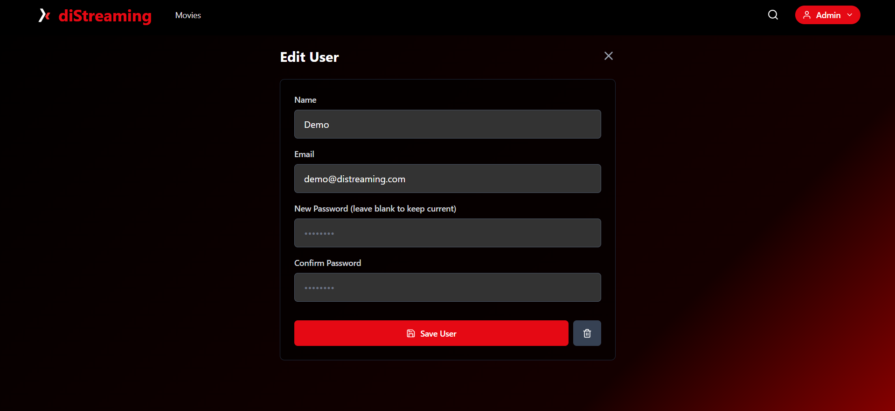

---

#### 🗑️ Hapus User (Admin Only)

**Endpoint:** `DELETE /api/v1/users/{id}`

**Headers:** `Authorization: Bearer {token}`

## 🛠️ Teknologi yang Digunakan

| Layer                  | Teknologi                                   | Deskripsi                                     |
| ---------------------- | ------------------------------------------- | --------------------------------------------- |
| **Frontend Framework** | [React 19](https://react.dev/)              | Library UI terbaru untuk antarmuka interaktif |
| **Build Tool**         | [Vite](https://vitejs.dev/)                 | Tooling frontend yang super cepat             |
| **Styling**            | [Tailwind CSS v4](https://tailwindcss.com/) | Framework CSS utility-first                   |
| **Routing**            | [React Router v7](https://reactrouter.com/) | Navigasi aplikasi dinamis                     |
| **State Management**   | React Context API                           | Pengelolaan status autentikasi global         |
| **HTTP Client**        | [Axios](https://axios-http.com/)            | Komunikasi data dengan API Backend            |
| **Icons**              | Custom SVG Icons and React-icons            | Ikon kustom untuk konsistensi desain          |
| **Backend**            | Laravel (PHP)                               | Framework PHP untuk REST API                  |
| **Database**           | Supabase (PostgreSQL)                       | Database cloud dengan PostgreSQL              |
| **Hosting**            | Vercel                                      | Platform deployment modern                    |

---

## 📂 Struktur Proyek

```
distreaming/
├── public/
│   ├── screenshots/     # Screenshot untuk dokumentasi
│   └── vite.svg         # Favicon
├── src/
│   ├── components/      # Komponen UI (Navbar, MovieCard, Footer)
│   ├── context/         # State global (AuthContext)
│   ├── hooks/           # Custom hooks (useMovies, useGenres, useFilters)
│   ├── Icon/            # Komponen ikon SVG
│   ├── pages/           # Halaman utama aplikasi
│   ├── routes/          # Konfigurasi routing (ProtectedRoute)
│   ├── App.jsx          # Komponen utama
│   └── main.jsx         # Entry point
└── index.html           # HTML utama
```

---

## 🚀 Cara Menjalankan Lokal

1. **Clone repository:**

   ```bash
   git clone https://github.com/agusdputra/distreaming.git
   cd distreaming
   ```

2. **Install dependencies:**

   ```bash
   npm install
   ```

3. **Setup environment:**

   ```bash
   cp .env.example .env
   ```

   Edit file `.env` dan isi dengan:

   ```
   VITE_API_BASE_URL=URL_YANG_DIGUNAKAN
   ```

4. **Jalankan development server:**

   ```bash
   npm run dev
   ```

5. **Buka browser:** Sesuai URL localhost dari project yang dijalankan.

---

## 📝 Catatan untuk Penguji

> [!IMPORTANT]
>
> - Gunakan akun demo atau daftar akun baru untuk mengakses fitur admin.
> - Semua endpoint `POST`, `PUT`, `DELETE` memerlukan token autentikasi.
> - Pastikan koneksi internet stabil karena aplikasi menggunakan API dari Vercel.

---

## 👨‍💻 Pengembang

Dikembangkan oleh **Agus Dzuriana Poetra** .

© 2026 diStreaming. All rights reserved.
